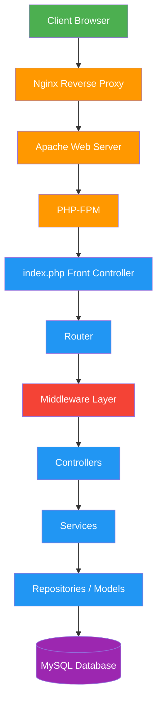
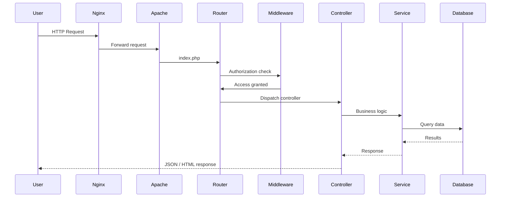
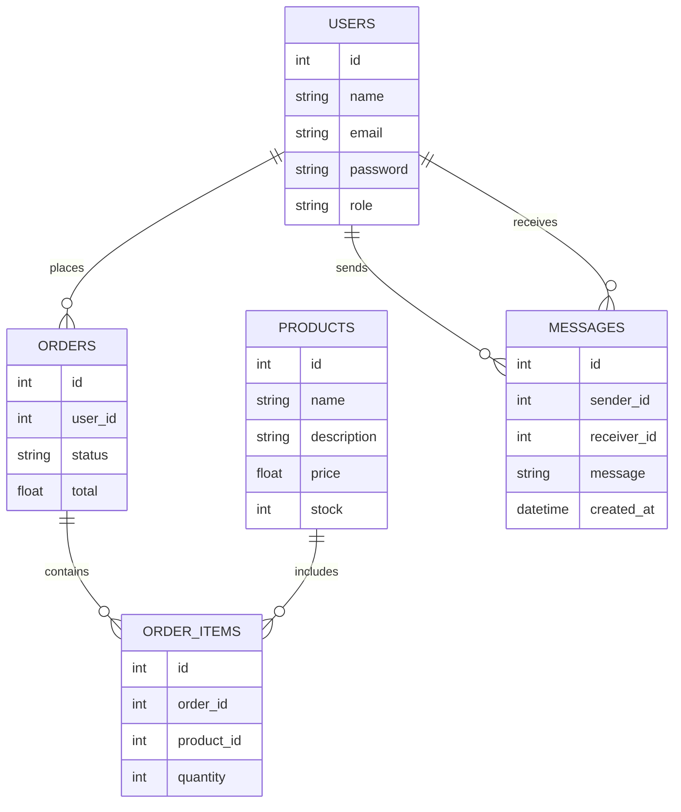

<p align="center">
  <h1 align="center">🛒 TimeStore</h1>
  <p align="center">
    A custom PHP e-commerce platform built with MVC architecture, a front controller, and a custom routing system.
  </p>
</p>

<p align="center">


</p>

---

# 🌐 Live Demo

Demo URL  https://timestore.imeshvishmika.me


---

# 📖 Project Overview

**TimeStore** is a full-stack **e-commerce web application** built using **PHP** with a custom **MVC architecture**, **Front Controller pattern**, and a **custom routing system**.

The platform allows users to browse products, place orders, and manage their purchase history while providing administrators with tools to manage products, users, orders, and revenue analytics.

The goal of this project is to demonstrate **backend system design, architecture principles, routing systems, middleware security, and real-world application workflows**.

---

# ⭐ Features

## 👤 User Features

- Browse product catalog
- Search and filter products
- Add items to cart
- Checkout with **PayHere sandbox payment gateway**
- View order history
- View order details
- Messaging system with administrators

---

## 🛠 Admin Features

- Add products
- Update products
- Delete products
- Search and filter products
- Manage users
- View sales history
- View revenue analytics
- Manage orders
- Communicate with users via messaging

---

# 🧰 Technology Stack

| Layer | Technology |
|------|------|
| Backend | PHP |
| Architecture | MVC |
| Router | Custom Router |
| Security | CSRF + Role Based Auth |
| Database | MySQL |
| Reverse Proxy | Nginx |
| Web Server | Apache |
| Runtime | PHP-FPM |
| Payment Gateway | PayHere Sandbox |

---

# 🏗 System Architecture


---

# 🔄 Request Lifecycle


---

# 🗄 Database Design



---

# 🔐 Security

TimeStore includes several security mechanisms.

Authentication

Session-based authentication.

Role-Based Authorization

Routes can define required roles.

Example:

"allows" => ["admin"]
CSRF Protection
hash_equals($_SESSION['csrf_token'], $_POST['csrf_token'])
Middleware Layer

Security checks are performed before controller execution.

---

# 📁 Project Structure

```text
timestore/
├── public/
│   ├── index.php
│   └── .htaccess
├── app/
│   ├── controllers/
│   │   ├── ProductController.php
│   │   ├── OrderController.php
│   │   └── UserController.php
│   ├── services/
│   │   ├── ProductService.php
│   │   └── OrderService.php
│   ├── models/
│   │   ├── ProductModel.php
│   │   ├── OrderModel.php
│   │   └── UserModel.php
│   ├── middleware/
│   │   ├── AuthMiddleware.php
│   │   └── CsrfMiddleware.php
│   ├── router/
│   │   └── Router.php
│   └── views/
├── config/
├── database/
└── docs/
    ├── images/
    └── banner.png
```
